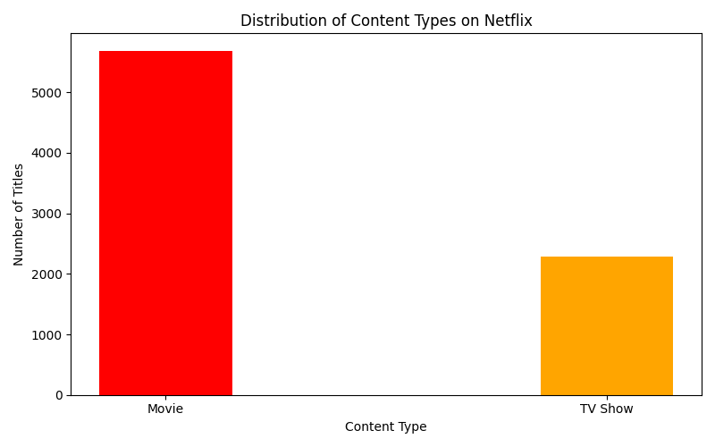
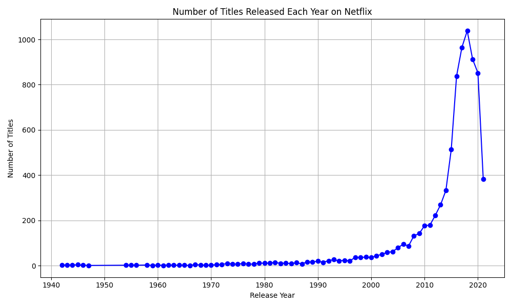
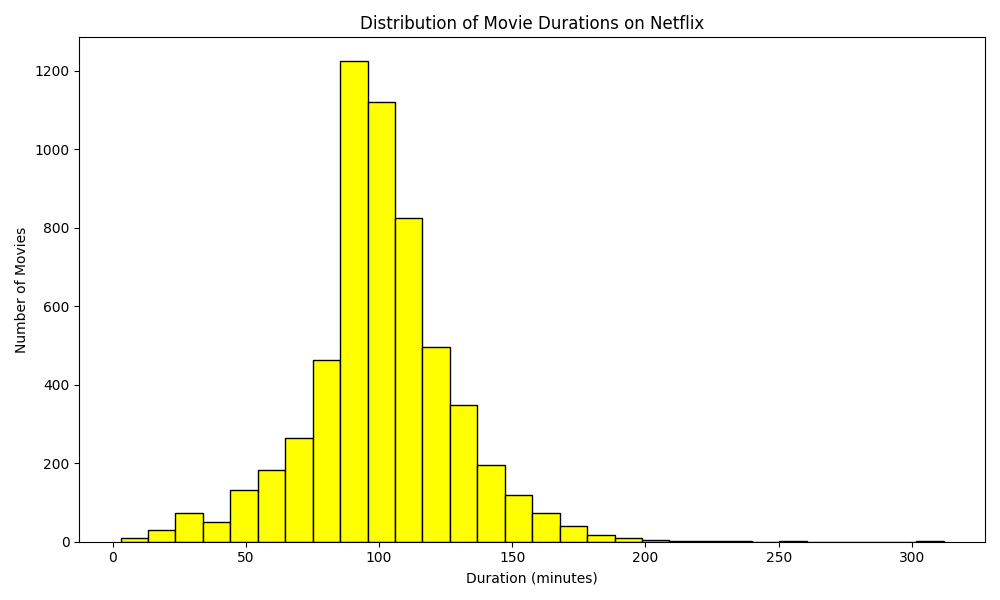
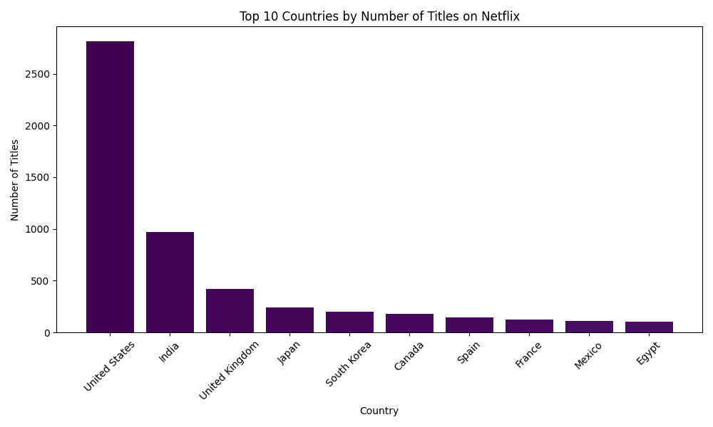
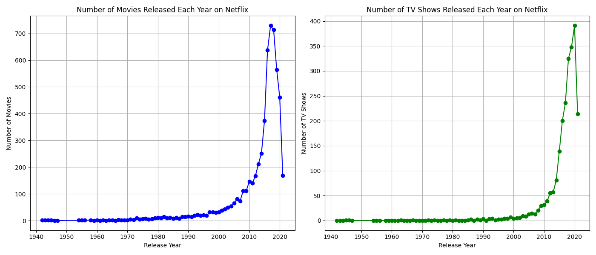

# 🎬 Netflix Data Analysis with Pandas & Matplotlib  

This project explores the **Netflix dataset** to understand trends in content type, ratings, release years, durations, and country contributions.  
The analysis is done using **Pandas** for data handling and **Matplotlib** for visualization.  

## 📂 Project Structure
netflix-analysis/
│── data/  
│── images/  
│── netflix_analysis.py  
│── requirements.txt  
│── README.md  

## 📊 Visualizations

### 1. Distribution of Content Types  
Shows how many **Movies vs TV Shows** are available.  

---

### 2. Distribution of Ratings  
Shows the percentage share of Netflix content across rating categories.  

---

### 3. Titles Released Each Year  
Trend of Netflix releases over the years.  

---

### 4. Movie Durations  
Distribution of movie lengths (in minutes).  

---

### 5. Top 10 Countries by Number of Titles  
Which countries contribute the most Netflix content.  

---

### 6. Content Trends Over Time  
Separate trends for **Movies vs TV Shows** over release years.  

## ⚙️ Installation & Usage

1. Clone the repository: 
   git clone https://github.com/sai182007/netflix-analysis.git
   cd netflix-analysis
